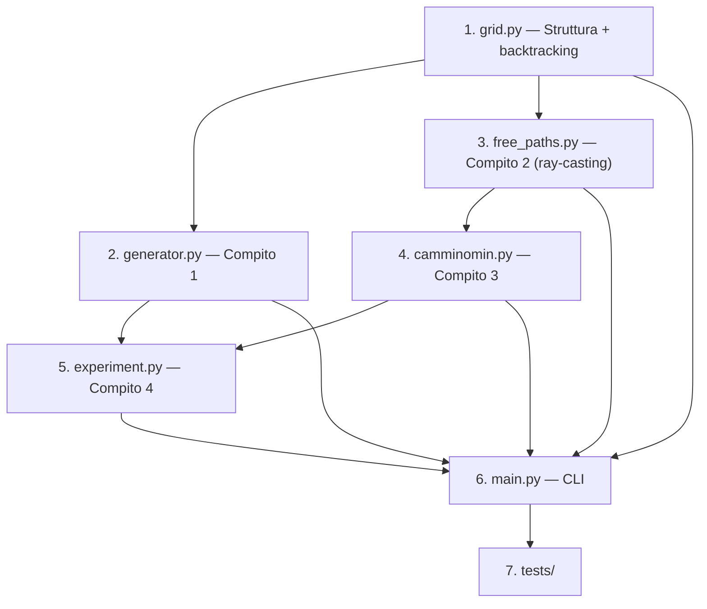

# Piano di Implementazione v3 — Elaborato Algoritmi e Strutture Dati

Elaborato a.a. 2024-25 (Prof.ssa Zanella). Griglie 8-connected, cammini liberi, cammino minimo.

**Linguaggio**: Python 3.13+ | **Gruppo**: 3 persone (requisiti completi)

---

## Struttura Progetto

```
AlgoritmiStruttureDati/
├── AlgoritmiElaborato.md
├── src/
│   ├── __init__.py
│   ├── grid.py                    # [NEW] Struttura dati griglia + backtracking
│   ├── generator.py               # [NEW] Compito 1 — Generatore griglie
│   ├── free_paths.py              # [NEW] Compito 2 — Contesto, complemento, dlib (ray-casting)
│   ├── camminomin.py              # [NEW] Compito 3 — Algoritmo CAMMINOMIN
│   ├── experiment.py              # [NEW] Compito 4 — Sperimentazione
│   └── utils.py                   # [NEW] Utility (I/O, vis)
├── tests/
│   ├── __init__.py
│   ├── test_grid.py
│   ├── test_generator.py
│   ├── test_free_paths.py
│   └── test_camminomin.py
├── grids/                         # Output griglie
├── results/                       # Output sperimentazione
├── main.py                        # [NEW] Entry point CLI
├── requirements.txt               # [NEW]
└── README.md                      # [NEW]
```

---

## Decisioni Progettuali

### Strutture Dati

| Struttura | Scelta | Perché |
|-----------|--------|--------|
| Griglia | `numpy.ndarray` dtype `uint8` | `0`=libera, `1`=ostacolo fisso, `2..N`=temp (backtracking). Compatto, O(1) |
| Coordinate | `tuple[int, int]` (row, col) | Compatibile numpy |
| Contesto/Complemento | `set[tuple[int,int]]` | Lookup O(1) |
| Frontiera | `list[tuple[tuple[int,int], int]]` — `[(cella, tipo)]` | Ordinabile per euristica |
| Sequenza landmark | `list[tuple[tuple[int,int], int]]` | Mapping diretto pseudocodice |

### Costanti

- Mossa cardinale: `1.0`
- Mossa diagonale: `√2`
- `(0,0)` = angolo alto-sinistra
- Riga ↓ = Sud, Colonna → = Est

---

## Fix Critici

### 1. Backtracking su Matrice di Stato (NO set union)

Matrice numpy `uint8` condivisa. Mark con `depth_id` prima di scendere, reset a `0` al ritorno.

```python
depth_id = current_depth + 2  # 0=free, 1=perm obstacle
for cell in closure_cells:
    grid_state[cell] = depth_id
# ... ricorsione ...
for cell in closure_cells:
    grid_state[cell] = 0
```

Controllo ostacolo: `grid_state[r, c] > 0`.

### 2. Limite Ricorsione

```python
sys.setrecursionlimit(10_000)  # main.py
```

### 3. Mosse Diagonali — Transito Spigolo Sempre OK

Mossa diag `(dr,dc)` da `(r,c)`: serve solo che target `(r+dr, c+dc)` sia libera. **No** check celle laterali `(r+dr,c)` e `(r,c+dc)`.

---

## Compito 1 — Generatore Griglie

### [NEW] [grid.py](file:///Users/filippocamossi/Developer/AlgoritmiStruttureDati/src/grid.py)

```python
class Grid:
    def __init__(self, rows, cols)        # numpy zeros uint8
    def is_traversable(self, r, c) -> bool
    def set_obstacle(self, r, c)          # state[r,c] = 1
    def mark_temp(self, cells, depth_id)  # backtracking mark
    def unmark_temp(self, cells)          # backtracking unmark → 0
    def neighbors(self, r, c) -> list     # 8-connected
    def save(self, path) / load(cls, path)
    def __repr__(self)                    # ASCII
```

### [NEW] [generator.py](file:///Users/filippocamossi/Developer/AlgoritmiStruttureDati/src/generator.py)

5 tipologie + mix:

| Tipo | Algoritmo | Parametri |
|------|-----------|-----------|
| `simple` | Celle singole random | `density` |
| `cluster` | Random walk da seme | `min_size`, `max_size` |
| `diagonal` | Coppie/triple diag-only | `count` |
| `enclosure` | Rettangoli bordo ostacoli | `min_side`, `max_side` |
| `bar` | Segmenti H/V con aperture | `thickness`, `min_len`, `max_len` |

---

## Compito 2 — Contesto, Complemento, dlib (RAY-CASTING)

### [NEW] [free_paths.py](file:///Users/filippocamossi/Developer/AlgoritmiStruttureDati/src/free_paths.py)

### dlib

```python
def dlib(o, d):
    dx = abs(o[1] - d[1])
    dy = abs(o[0] - d[0])
    d_min, d_max = min(dx, dy), max(dx, dy)
    return math.sqrt(2) * d_min + (d_max - d_min)
```

### Quadranti — Tabella Vettori

| Quadrante | Condizione (D vs O) | Diag `(dr,dc)` | Card dominante |
|-----------|---------------------|----------------|----------------|
| I (NE) | `d_row < o_row` e `d_col > o_col` | `(-1, +1)` | H `(0,+1)` se Δx>Δy, V `(-1,0)` altrimenti |
| II (NW) | `d_row < o_row` e `d_col < o_col` | `(-1, -1)` | H `(0,-1)` se Δx>Δy, V `(-1,0)` altrimenti |
| III (SW) | `d_row > o_row` e `d_col < o_col` | `(+1, -1)` | H `(0,-1)` se Δx>Δy, V `(+1,0)` altrimenti |
| IV (SE) | `d_row > o_row` e `d_col > o_col` | `(+1, +1)` | H `(0,+1)` se Δx>Δy, V `(+1,0)` altrimenti |

> [!IMPORTANT]
> Celle sugli assi (stessa riga o stessa colonna di O): solo mosse cardinali. Celle sulla diagonale esatta (`Δx==Δy`): solo mosse diagonali. In entrambi i casi tipo 1 = tipo 2, esiste al più 1 cammino libero.

### RAY-CASTING: Contesto (Tipo 1) — IMPLEMENTAZIONE BASE

> [!WARNING]
> Il doppio ciclo naive `for r for c → free_path_type1(o, (r,c))` costa **O(R·C·max(R,C))** per invocazione. Su 200×200 = ~8M operazioni PER NODO RICORSIVO. **Inaccettabile**. Il ray-casting è l'implementazione di default.

**Idea**: Un cammino libero tipo 1 = diag prima, card dopo. Ogni cella raggiungibile con tipo 1 si trova lungo un "raggio" composto da un tratto diagonale + estensione cardinale. Tracciamo i raggi da O e raccogliamo tutte le celle lungo il cammino.

**Algoritmo ray-casting per contesto (tipo 1):**

```python
def compute_context_rays(o, grid_state) -> set:
    """
    Ray-casting: espandi raggi tipo 1 da O in tutti i quadranti.
    Complessità: O(max(R,C)²) — molto meglio di O(R·C·max(R,C)).
    """
    context = {o}
    rows, cols = grid_state.shape
    
    # === FASE A: Celle sugli assi di O (solo cardinali) ===
    # 4 direzioni cardinali puri: N, S, E, W
    for card_dr, card_dc in [(-1,0), (1,0), (0,-1), (0,1)]:
        r, c = o
        while True:
            r, c = r + card_dr, c + card_dc
            if not (0 <= r < rows and 0 <= c < cols):
                break
            if grid_state[r, c] > 0:  # ostacolo
                break
            context.add((r, c))
    
    # === FASE B: Celle nei 4 quadranti ===
    # Per ogni quadrante: cammina in diagonale step by step.
    # Ad ogni posizione M lungo la diagonale, M è nel contesto.
    # Da M, estendi cardinalmente (la componente del Δ_max).
    # Tutte celle lungo estensione cardinale → nel contesto.
    
    for diag_dr, diag_dc in [(-1,+1), (-1,-1), (+1,-1), (+1,+1)]:
        r, c = o
        
        # Cammina lungo diagonale
        while True:
            r, c = r + diag_dr, c + diag_dc
            if not (0 <= r < rows and 0 <= c < cols):
                break
            if grid_state[r, c] > 0:
                break  # diag bloccata → stop intero raggio
            
            context.add((r, c))  # M è raggiungibile (pura diag)
            
            # Da M, estendi in direzione orizzontale (dc)
            er, ec = r, c
            while True:
                ec = ec + diag_dc
                if not (0 <= ec < cols):
                    break
                if grid_state[er, ec] > 0:
                    break
                context.add((er, ec))
            
            # Da M, estendi in direzione verticale (dr)
            er, ec = r, c
            while True:
                er = er + diag_dr
                if not (0 <= er < rows):
                    break
                if grid_state[er, ec] > 0:
                    break
                context.add((er, ec))
    
    return context
```

**Perché funziona**: Un cammino libero tipo 1 da O a D = `Δ_min` passi diag + `(Δ_max - Δ_min)` passi card. Ogni posizione intermedia M dopo i passi diag è il "gomito" del cammino. Se il tratto diag O→M è libero **e** il tratto card M→D è libero, allora D è nel contesto. Il ray-casting traccia esattamente questo: diag da O finché libero, poi da ogni gomito M estendi in card finché libero.

**Complessità**: Ci sono O(max(R,C)) posizioni diagonali. Per ognuna, l'estensione cardinale costa O(max(R,C)). Totale: O(max(R,C)²) per quadrante, × 4 quadranti + 4 assi = **O(max(R,C)²)**.

### RAY-CASTING: Complemento (Tipo 2) — Speculare

Tipo 2 = card prima, diag dopo. Raggio inverso: cammina lungo cardinale da O, ad ogni posizione M estendi in diagonale.

```python
def compute_complement_rays(o, grid_state, context) -> set:
    """
    Ray-casting tipo 2. Aggiunge solo celle NON già nel contesto.
    """
    complement = set()
    rows, cols = grid_state.shape
    
    # Celle sugli assi già coperte dal contesto (tipo1 = tipo2 per assi)
    
    # Per ogni coppia (card, diag) nei 4 quadranti:
    # Card = asse dominante. Per quadrante I: 
    #   - H-first: cammina E, ad ogni step estendi NE diag
    #   - V-first: cammina N, ad ogni step estendi NE diag
    
    for diag_dr, diag_dc in [(-1,+1), (-1,-1), (+1,-1), (+1,+1)]:
        # Tipo 2 con componente orizzontale prima:
        # cammina orizzontalmente (dc), poi da ogni M estendi in diag
        r, c = o
        while True:
            c = c + diag_dc  # passo orizzontale
            if not (0 <= c < cols):
                break
            if grid_state[r, c] > 0:
                break
            # (r, c) sugli assi → già nel contesto, skip
            # Da qui estendi in diagonale
            dr2, dc2 = r, c
            while True:
                dr2, dc2 = dr2 + diag_dr, dc2 + diag_dc
                if not (0 <= dr2 < rows and 0 <= dc2 < cols):
                    break
                if grid_state[dr2, dc2] > 0:
                    break
                cell = (dr2, dc2)
                if cell not in context:
                    complement.add(cell)
        
        # Tipo 2 con componente verticale prima:
        # cammina verticalmente (dr), poi da ogni M estendi in diag
        r, c = o
        while True:
            r = r + diag_dr  # passo verticale
            if not (0 <= r < rows):
                break
            if grid_state[r, c] > 0:
                break
            # Da qui estendi in diagonale
            dr2, dc2 = r, c
            while True:
                dr2, dc2 = dr2 + diag_dr, dc2 + diag_dc
                if not (0 <= dr2 < rows and 0 <= dc2 < cols):
                    break
                if grid_state[dr2, dc2] > 0:
                    break
                cell = (dr2, dc2)
                if cell not in context:
                    complement.add(cell)
    
    return complement
```

**Stessa complessità**: O(max(R,C)²) per invocazione.

### Cammino Libero Tipo 1 — Per Ricostruzione

Questa funzione serve per verificare/ricostruire un singolo cammino (usata in `reconstruct_path`), **non** per il contesto.

```python
def free_path_type1(o, d, grid_state) -> list | None:
    dx = abs(o[1] - d[1])
    dy = abs(o[0] - d[0])
    d_min, d_max = min(dx, dy), max(dx, dy)
    diag_dr, diag_dc = get_diag_direction(o, d)
    
    if dx > dy:
        card_dr, card_dc = 0, diag_dc      # orizzontale
    elif dy > dx:
        card_dr, card_dc = diag_dr, 0      # verticale
    else:
        card_dr, card_dc = 0, 0            # pura diag, no card
    
    path = [o]
    r, c = o
    
    for _ in range(d_min):                  # (a) diag
        r, c = r + diag_dr, c + diag_dc
        if grid_state[r, c] > 0:
            return None
        path.append((r, c))
    
    for _ in range(d_max - d_min):          # (b) card
        r, c = r + card_dr, c + card_dc
        if grid_state[r, c] > 0:
            return None
        path.append((r, c))
    
    return path


def free_path_type2(o, d, grid_state) -> list | None:
    """Tipo 2: card prima, diag dopo."""
    # Stessa logica, loop invertiti
    dx = abs(o[1] - d[1])
    dy = abs(o[0] - d[0])
    d_min, d_max = min(dx, dy), max(dx, dy)
    diag_dr, diag_dc = get_diag_direction(o, d)
    
    if dx > dy:
        card_dr, card_dc = 0, diag_dc
    elif dy > dx:
        card_dr, card_dc = diag_dr, 0
    else:
        card_dr, card_dc = 0, 0
    
    path = [o]
    r, c = o
    
    for _ in range(d_max - d_min):          # (b) card PRIMA
        r, c = r + card_dr, c + card_dc
        if grid_state[r, c] > 0:
            return None
        path.append((r, c))
    
    for _ in range(d_min):                  # (a) diag DOPO
        r, c = r + diag_dr, c + diag_dc
        if grid_state[r, c] > 0:
            return None
        path.append((r, c))
    
    return path


def get_diag_direction(o, d):
    """Ritorna (dr, dc) della componente diagonale."""
    dr = 1 if d[0] > o[0] else (-1 if d[0] < o[0] else 0)
    dc = 1 if d[1] > o[1] else (-1 if d[1] < o[1] else 0)
    return dr, dc
```

### Frontiera

```python
def compute_frontier(context, complement, grid_state) -> list:
    closure = context | complement
    frontier = []
    rows, cols = grid_state.shape
    
    for cell in closure:
        r, c = cell
        is_frontier = False
        for dr in (-1, 0, 1):
            for dc in (-1, 0, 1):
                if dr == 0 and dc == 0:
                    continue
                nr, nc = r + dr, c + dc
                if 0 <= nr < rows and 0 <= nc < cols:
                    if grid_state[nr, nc] == 0 and (nr, nc) not in closure:
                        is_frontier = True
                        break
            if is_frontier:
                break
        if is_frontier:
            tipo = 1 if cell in context else 2
            frontier.append((cell, tipo))
    
    return frontier
```

---

## Compito 3 — CAMMINOMIN

### [NEW] [camminomin.py](file:///Users/filippocamossi/Developer/AlgoritmiStruttureDati/src/camminomin.py)

```python
import math, time

def camminomin(o, d, grid_state, depth=0, stats=None, 
               start_time=None, timeout=None, use_strong_pruning=False):
    """
    Ritorna (lunghezza_min, seq_landmark, timed_out).
    grid_state: numpy uint8 condiviso (backtracking in-place).
    """
    # Timeout
    if timeout and start_time and time.time() - start_time > timeout:
        return float('inf'), [], True
    
    # Chiusura via ray-casting
    context = compute_context_rays(o, grid_state)
    
    if d in context:
        return dlib(o, d), [(o, 0), (d, 1)], False
    
    complement = compute_complement_rays(o, grid_state, context)
    
    if d in complement:
        return dlib(o, d), [(o, 0), (d, 2)], False
    
    frontier = compute_frontier(context, complement, grid_state)
    
    if stats:
        stats['frontier_cells'] += len(frontier)
    
    if not frontier:
        return float('inf'), [], False
    
    # Ordinamento euristico: dlib(F,D) crescente
    frontier.sort(key=lambda ft: dlib(ft[0], d))
    
    min_length = float('inf')
    min_seq = []
    closure = context | complement
    
    # BACKTRACKING: marca chiusura
    depth_id = depth + 2
    for cell in closure:
        grid_state[cell] = depth_id
    
    timed_out = False
    for (f, t) in frontier:
        lf = dlib(o, f)
        
        # Pruning condizionale
        if use_strong_pruning:
            should_explore = (lf + dlib(f, d)) < min_length
        else:
            should_explore = lf < min_length
        
        if stats and not should_explore:
            stats['pruning_false'] += 1
        
        if should_explore:
            grid_state[f] = 0  # sblocca F
            
            lfd, seq_fd, timed_out = camminomin(
                f, d, grid_state, depth + 1,
                stats, start_time, timeout, use_strong_pruning
            )
            
            grid_state[f] = depth_id  # rimarca F
            
            l_tot = lf + lfd
            if l_tot < min_length:
                min_length = l_tot
                min_seq = compact([(o, 0), (f, t)], seq_fd)
            
            if timed_out:
                break
    
    # BACKTRACKING: ripristina
    for cell in closure:
        grid_state[cell] = 0
    
    return min_length, min_seq, timed_out


def compact(seq1, seq2):
    return seq1 + seq2[1:]
```

### Ricostruzione Cammino Completo

```python
def reconstruct_path(landmarks, grid_state) -> list:
    full_path = []
    for i in range(len(landmarks) - 1):
        src, _ = landmarks[i]
        dst, tipo = landmarks[i + 1]
        segment = free_path_type1(src, dst, grid_state) if tipo == 1 \
                  else free_path_type2(src, dst, grid_state)
        full_path.extend(segment if i == 0 else segment[1:])
    return full_path
```

---

## Compito 4 — Sperimentazione

### [NEW] [experiment.py](file:///Users/filippocamossi/Developer/AlgoritmiStruttureDati/src/experiment.py)

### Correttezza

```python
# Per ogni (O, D): camminomin(O,D) vs camminomin(D,O) → stessa lunghezza
assert abs(len1 - len2) < 1e-9
```

### Campagne

| Parametro | Valori | Scopo |
|---|---|---|
| Dimensioni | 10², 20², 50², 100², 200² | Scaling |
| Densità | 0.05, 0.10, 0.20, 0.30, 0.40 | Picco ~20-30% |
| Tipologia | Ogni tipo + mix | Topologie |
| Distanza O↔D | Vicini/lontani/diag | Profondità ricorsione |
| Pruning | riga 16 vs riga 17 | Efficacia |
| Ordinamento frontiera | Random vs `dlib(F,D)` crescente | Sinergia con pruning |

### Metriche

Wall-clock, memoria picco, celle frontiera, invocazioni ricorsive, profondità max, pruning falso, cammini esplorati.

### Grafici Relazione

1. **Tempo vs Densità** → curva campana, picco 20-30%
2. **Pruning riga 16 vs 17** → barre nodi esplorati. Con ordinamento frontiera + riga 17 → crollo verticale nodi
3. **Ordinamento frontiera** → scatter pruning falso con/senza
4. **Tempo vs Dimensione** → log-log scaling

### Riassunto (Slide 71)

```python
{
    "grid_dimensions": (rows, cols),
    "grid_type": "...",
    "origin": o, "destination": d,
    "min_path_length": ...,
    "landmarks": [...],
    "total_frontier_cells": ...,
    "pruning_false_count": ...,
    "elapsed_time_s": ...,
    "memory_peak_mb": ...,
    "completed": True/False
}
```

---

## CLI

### [NEW] [main.py](file:///Users/filippocamossi/Developer/AlgoritmiStruttureDati/main.py)

```bash
python main.py generate --rows 50 --cols 50 --types simple cluster bar --density 0.2 --seed 42 -o grids/g.json
python main.py context --grid grids/g.json --origin 10,10
python main.py dlib --origin 10,10 --dest 40,40
python main.py camminomin --grid grids/g.json --origin 10,10 --dest 40,40 --timeout 60 --strong-pruning --summary
python main.py experiment --config experiment_config.json
```

`sys.setrecursionlimit(10_000)` in testa.

---

## Dipendenze

```
numpy>=1.24
```

Matplotlib opzionale per grafici.

---

## Verifica

| Test | Cosa |
|------|------|
| `test_grid.py` | Creazione, neighbors, serializzazione, mark/unmark |
| `test_generator.py` | Ogni tipologia valida, densità OK |
| `test_free_paths.py` | dlib casi noti, ray-casting su griglia vuota = tutta griglia, tipo1/tipo2 singolo cammino |
| `test_camminomin.py` | Griglia vuota → diretto, simmetria O↔D, partizionamento → ∞, esempio specifica 4√2+9 |

---

## Ordine Implementazione



Piano v3 pronto. Ray-casting = default. Aspetto OK per codice.
