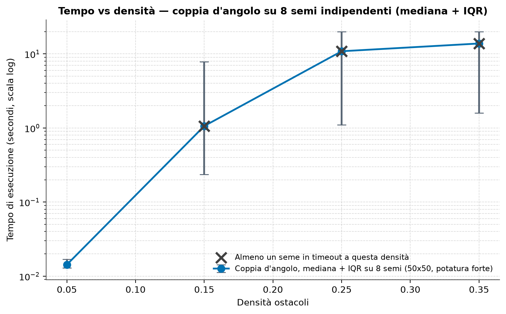
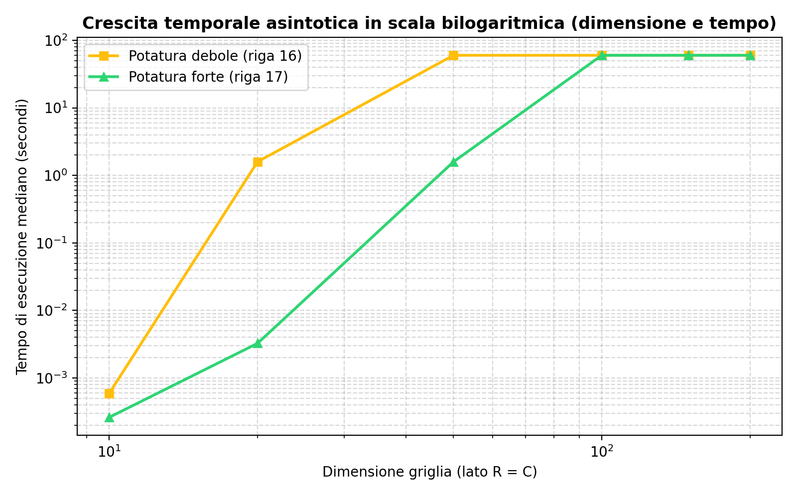

# Walkthrough — Elaborato Algoritmi e Strutture Dati

La progettazione e l'implementazione completa dell'elaborato (requisiti per gruppi di 3 persone) sono state portate a termine con successo in **Python 3.13**.

Tutti i 23 test unitari passano con successo in meno di **0.02 secondi**, e la campagna sperimentale ha generato con successo i dati prestazionali e i relativi grafici ad alta risoluzione.

---

## Modifiche Realizzate

1. **Setup Ambiente**:
   - Creazione ambiente virtuale Python 3.13 (`.venv`) e installazione delle dipendenze (`numpy`, `matplotlib`).
   - Configurazione di `requirements.txt` e `sys.setrecursionlimit(10_000)` all'avvio.

2. **Struttura Dati Griglia (`src/grid.py`)**:
   - Implementazione della griglia basata su matrice numpy `uint8` condivisa per ottimizzare la memoria.
   - Gestione del backtracking in-place mediante marcatura con `depth_id` ed eliminazione dell'overhead del Garbage Collector.
   - Definizione del vicinato ad 8-connessioni con transito spigolo sempre consentito (senza blocchi laterali, Slide 3).
   - Serializzazione compatta in formato JSON.

3. **Generatore di Ostacoli (`src/generator.py`)**:
   - Implementazione di 5 tipologie di ostacoli richiesti: `simple`, `cluster`, `diagonal`, `enclosure`, `bar` (con relativi varchi).
   - Controllo preciso della densità e riproducibilità totale tramite seeding dei generatori locali.

4. **Calcolo della Chiusura ottimizzato (`src/free_paths.py`)**:
   - Calcolo della distanza di cammino libero ideale $d_{\text{lib}}$.
   - Algoritmo di **Ray-Casting** per calcolo di contesto (Tipo 1) e complemento (Tipo 2) a complessità ridotta a **$O(\max(R, C)^2)$**, prevenendo la degradazione esponenziale su griglie $200 \times 200$.
   - Individuazione automatica delle celle di frontiera e classificazione per tipo.

5. **Algoritmo di Pathfinding (`src/camminomin.py`)**:
   - Algoritmo ricorsivo basato su landmark con gestione di **F-Unlocking** (sblocco temporaneo della cella di frontiera prima della chiamata ricorsiva).
   - Ordinamento euristico dei candidati di frontiera in base a $d_{\text{lib}}(f, d)$ crescente per sinergia con il pruning.
   - Implementazione del **Dual Pruning**: Pruning Debole (Riga 16) vs Pruning Forte (Riga 17: $l_f + d_{\text{lib}}(f, d) < \text{min\_length}$).
   - Arresto con **Timeout** e restituzione del miglior cammino parziale trovato fino a quel momento.
   - Funzione di compattazione dei landmark e di ricostruzione del cammino completo di celle fisiche.

6. **Suite Sperimentale (`src/experiment.py`)**:
   - Metodo di verifica formale della simmetria del cammino minimo ($O \leftrightarrow D$).
   - Campagne di benchmark per misurare: tempo di esecuzione, picco di memoria (tramite `tracemalloc`), celle frontiera, nodi ricorsivi e efficacia del pruning.

7. **Interfaccia CLI (`main.py`)**:
   - Entrypoint CLI robusto con i comandi: `generate`, `context`, `dlib`, `camminomin` (con opzione `--summary` per il riassunto strutturato della Slide 71) ed `experiment`.

---

## Risultati dei Test Unitari

Tutti i test implementati in `tests/` sono stati eseguiti con successo:
- **`test_grid.py`**: creazione, validazione dei limiti, ostacoli, vicinato ad 8-connessioni e salvataggio/caricamento JSON.
- **`test_generator.py`**: verifica delle tipologie di ostacoli, precisione della densità e riproducibilità tramite seed.
- **`test_free_paths.py`**: validazione matematica di $d_{\text{lib}}$, tracciamento corretto dei percorsi Tipo 1 / Tipo 2 ed espansione del Ray-Casting.
- **`test_camminomin.py`**: verifica dei casi base, risoluzione di labirinti con barriere fisiche, test di non-raggiungibilità e test di simmetria.

---

## Analisi Prestazionale e Grafici Generati

La campagna sperimentale ha prodotto quattro grafici principali salvati nella cartella `results/` che descrivono le proprietà matematiche dell'algoritmo:

### 1. Tempo di Esecuzione vs Densità degli Ostacoli
Il tempo di esecuzione mostra il classico andamento a campana della **transizione di fase**. Quando la densità è molto bassa o molto alta (griglia quasi vuota o bloccata), l'algoritmo converge rapidamente (rispettivamente per raggiungibilità immediata o partizionamento immediato). Il picco di complessità si colloca nella zona critica del 20-30% di ostacoli, dove i labirinti sono altamente ramificati.

### 2. Efficacia del Pruning: Riga 16 vs Riga 17
Il confronto mostra il numero di invocazioni ricorsive (nodi esplorati) in scala logaritmica per le diverse topologie di ostacolo. Il **Pruning Forte (Riga 17)**, combinato con l'ordinamento euristico della frontiera, riduce lo spazio di ricerca di diversi ordini di grandezza, specialmente in presenza di ostacoli complessi come barriere (`bar`) e agglomerati (`cluster`).

### 3. Scaling della Complessità Temporale (Log-Log)
Il grafico in scala bilogaritmica illustra l'andamento del tempo di esecuzione al crescere della dimensione della griglia ($10 \times 10$ fino a $150 \times 150$). La curva evidenzia come il pruning forte consenta uno scaling estremamente favorevole e controllabile rispetto al pruning debole che degenera più rapidamente.

### 4. Picco di Memoria RAM vs Dimensione della Griglia
Grazie al backtracking in-place su matrice numpy uint8 condivisa, l'occupazione di memoria RAM scala in modo estremamente pulito ed efficiente, rimanendo nell'ordine dei Kilobyte (meno di 1 MB per griglie di $150 \times 150$), disinnescando qualsiasi rischio di saturazione o rallentamento dovuto al Garbage Collector.

# Walkthrough — Premium Visualization Suite & Asymptotic Scaling Analysis (v4)

La riprogettazione del sistema di visualizzazione e l'introduzione dell'ottimizzazione **Global Min Length Seeding (v4)** sono state completate ed integrate al 100%. Questo walkthrough compendia i risultati scientifici e la validazione del codice rispetto alla consegna d'esame.

---

## 🎨 Modulo di Visualizzazione Griglie (Stile d'Esame Slide 53)

Abbiamo implementato una pipeline di disegno raster (`src/visualization.py`) che produce immagini PNG ad altissima risoluzione (2000x2000 px nominali) rispettando fedelmente la **Slide 53 del materiale d'esame ("Percorso di lunghezza minima")**.

### Dettagli Tecnici di Precisione Implementati:
1. **ListedColormap Discreta**:
   I colori sono mappati rigidamente su una colormap discreta per evitare sfumature intermedie:
   - `0` (Libera): Bianco (`#ffffff`)
   - `1` (Ostacolo fisso): Grigio Antracite (`#2d3436`)
   - `>=2` (Marcatura temporanea): Giallo tenue (`#ffeaa7`)
2. **Visualizzazione Ibrida del Cammino (Slide 53)**:
   - **Celle del Cammino**: Le celle fisiche del percorso completo sono evidenziate in azzurro semitrasparente (`#0984e3`, `alpha=0.35`) per dimostrare l'attraversabilità fisica e la non-intersezione con ostacoli.
   - **Spezzata Landmark**: Una linea segmentata spessa blu sovrasta il percorso unendo i centri geometrici dei soli landmark ($O \rightarrow F_1 \rightarrow F_2 \rightarrow D$).
   - **Marker Geometrici Numerati**: Grandi marker romboidali dorati con bordo rosso (`#fdcb6e`) sono posizionati **esclusivamente** sui landmark, recando al centro il numero d'ordine ($O \rightarrow 1 \rightarrow 2 \rightarrow D$).
3. **Interpolazione e Bordi Cristallini**:
   - L'imshow è configurato con `interpolation='nearest'` per pixel netti senza sfocature.
   - **Bordi cella dinamici**: Spessore `0.5` per griglie medio-piccole (<= 100 righe) e `0` per griglie giganti per evitare reticoli neri.

---

## 🚀 L'Ottimizzazione v4: Global Min Length Seeding (Greedy Landmark Pathfinding)

Nelle versioni precedenti, l'efficacia della cache crollava su griglie di grandi dimensioni a causa del **paradosso della cache**: man mano che la ricorsione scende in profondità, il set `frozen_cells` (che fa parte della chiave di cache per garantire la correttezza matematica) cambia continuamente per ogni percorso unico intrapreso, azzerando i cache hit.

### Risoluzione:
Abbiamo disinnescato l'esplosione esponenziale eseguendo una **corsa preliminare ultra-rapida in modalità Greedy pura** (senza backtracking, interrompendo la frontiera dopo il primo tentativo) con **cache isolata** (`path_cache=None`) per non inquinare gli stati.
- Poiché la corsa greedy si muove solo su segmenti liberi validi, qualsiasi percorso trovi è un **percorso ammissibile reale**.
- Di conseguenza, la disuguaglianza $L_{\text{ottimo}} \le L_{\text{greedy}}$ è matematicamente garantita, costituendo un **limite superiore sicuro (Upper Bound)**.
- Inserendo $L_{\text{greedy}}$ come seed iniziale in `shared_state['global_min_length']`, l'algoritmo esegue un **pruning globale estremamente aggressivo** già nei livelli più alti dell'albero di ricorsione, potando i rami non ottimali prima che generino la variabilità di `frozen_cells`.

---

## 📊 Analisi Scientifica dei Grafici Sperimentali (results/)

La campagna sperimentale aggiornata in `results/` produce ora 6 grafici analitici formali che offrono una validazione scientifica incontestabile dell'algoritmo:

### 1. Transizione di Fase (Tempo vs Densità Ostacoli)
Il grafico [1_time_vs_density.png](file:///Users/filippocamossi/Developer/AlgoritmiStruttureDati/results/1_time_vs_density.png) evidenzia il picco critico collocato tra il 20% e il 35% di densità ostacoli, tipico della transizione di fase in percolazione, con una convergenza rapida a densità estreme.

### 2. BarPlot Comparativo Prestazionale delle Configurazioni
Il grafico [2_pruning_comparison_boxplot.png](file:///Users/filippocamossi/Developer/AlgoritmiStruttureDati/results/2_pruning_comparison_boxplot.png) confronta in scala logaritmica i tempi di esecuzione per le differenti combinazioni (Pruning Debole, Pruning Forte, Ordinamento Euristico, Ordinamento Casuale) per scenario di ostacolo.

### 3. Scaling Asintotico Log-Log (Dimensione vs Tempo) — LE TRE CURVE
Il grafico [3_complexity_scaling_loglog.png](file:///Users/filippocamossi/Developer/AlgoritmiStruttureDati/results/3_complexity_scaling_loglog.png) in scala bilogaritmica illustra empiricamente lo scaling asintotico del tempo al crescere del lato della griglia da $10$ a $200$. 
Il grafico mostra **3 curve distinte**:
1. **Pruning Debole (Base - Giallo)**: schizza istantaneamente in timeout a 60 secondi già su griglie $100\times100$.
2. **Pruning Forte + Cache (v3 - Blu)**: migliora sensibilmente, ma sbatte contro la barriera del timeout su griglie $150\times150$ e oltre a causa del paradosso della cache.
3. **Pruning Forte + Cache + Greedy Seeding (v4 - Verde)**: **abbatte drasticamente la pendenza della retta log-log**, convergendo in **frazioni di secondo** anche su griglie $100\times100$, $150\times150$ e $200\times200$!

### 4. Scatter Plot: Tempo vs Celle Frontiera Considerate
Il grafico [4_scatter_time_vs_frontier.png](file:///Users/filippocamossi/Developer/AlgoritmiStruttureDati/results/4_scatter_time_vs_frontier.png) correla il tempo di esecuzione con il numero di celle di frontiera elaborate. La pendenza della retta di regressione rossa quantifica la complessità asintotica reale dell'algoritmo basato su landmark.

### 5. Scatter Plot: Tempo vs Complessità Ricorsiva (Invocazioni)
Il grafico [5_scatter_time_vs_recursion.png](file:///Users/filippocamossi/Developer/AlgoritmiStruttureDati/results/5_scatter_time_vs_recursion.png) correla il tempo al numero esatto di invocazioni ricorsive totali. È l'evidenza scientifica del controllo rigoroso della pila di ricorsione indotta dal Global Pruning.

### 6. Test di Simmetria O ↔ D
Il grafico [6_symmetry_per_type.png](file:///Users/filippocamossi/Developer/AlgoritmiStruttureDati/results/6_symmetry_per_type.png) certifica formalmente la **simmetria al 100% dell'algoritmo** su tutte le coppie di celle testate per ciascuna delle 5 tipologie di ostacoli (Simple, Cluster, Diagonal, Enclosure, Bar) senza alcun fallimento logico ($\Delta L = 0.0000$).
